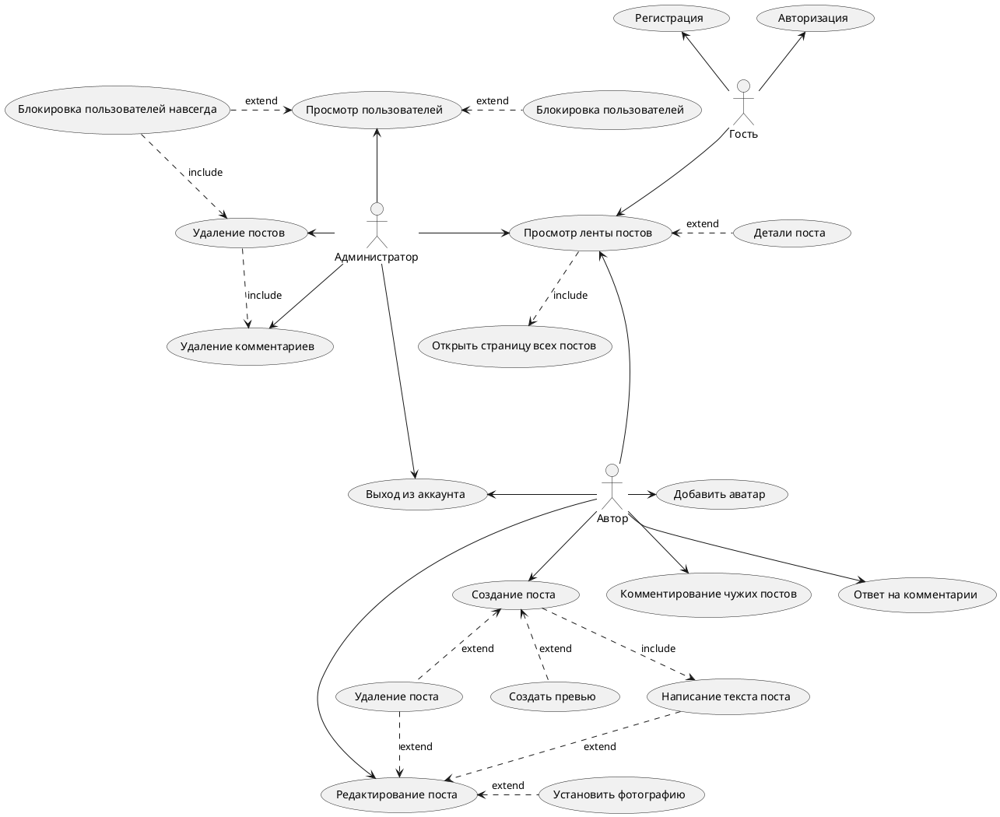
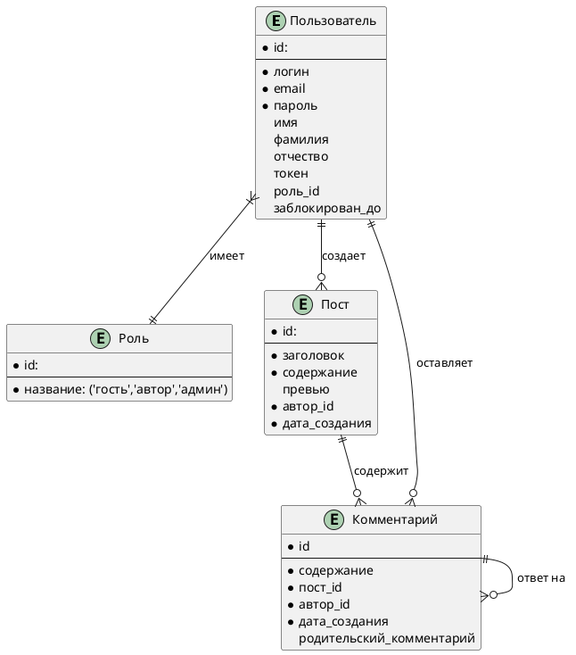

# Предложенная предметная область
### Use-case

```plantuml
@startuml
actor Гость as guest
actor Автор as author
actor Администратор as admin

guest -down-> (Просмотр ленты постов)
guest -up-> (Авторизация)
guest -up-> (Регистрация)

(Просмотр ленты постов) <. (Детали поста): extend
(Просмотр ленты постов) .down.>  (Открыть страницу всех постов):include


author -down-> (Создание поста)
author -up-> (Редактирование поста)
author -down-> (Комментирование чужих постов)
author --left-> (Просмотр ленты постов)
author -down-> (Ответ на комментарии)
author ---left-> (Выход из аккаунта)
author -> (Добавить аватар)

(Редактирование поста) <.up. (Удаление поста): extend
(Редактирование поста) <. (Установить фотографию): extend
(Создание поста) <.down. (Создать превью): extend
(Создание поста) <.down. (Удаление поста): extend
(Создание поста) .down.> (Написание текста поста): include
(Редактирование поста) <.up. (Написание текста поста): extend

admin -up-> (Просмотр пользователей)
admin --right-> (Просмотр ленты постов)
admin -left-> (Удаление постов)
admin -down-> (Удаление комментариев)
admin ---down-> (Выход из аккаунта)

(Удаление постов) .> (Удаление комментариев): include
(Просмотр пользователей) <. (Блокировка пользователей): extend
(Просмотр пользователей) <.left. (Блокировка пользователей навсегда): extend
(Блокировка пользователей навсегда) .down.> (Удаление постов): include

@enduml
```
### ER

```plantuml
@startuml
' Entities
entity "Пользователь" as user {
  *id:
  --
  *логин
  *email
  *пароль
  имя
  фамилия
  отчество
  токен
  роль_id
  заблокирован_до
}

entity "Роль" as role {
  *id:
  --
  *название: ('гость','автор','админ')
}

entity "Пост" as post {
  *id:
  --
  *заголовок
  *содержание
  превью
  *автор_id
  *дата_создания
}

entity "Комментарий" as comment {
  *id
  --
  *содержание
  *пост_id
  *автор_id
  *дата_создания
  родительский_комментарий
}

' Relationships
user }|--|| role : "имеет"
user ||--o{ post : "создает"
post ||--o{ comment : "содержит"
user ||--o{ comment : "оставляет"
comment ||--o{ comment : "ответ на"

@enduml
```
# Языковая школа