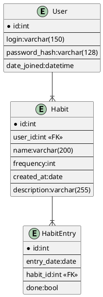

---
tags:
  - диаграмма
версия: v.1.0
дата: 2025-09-19
---

```plantuml
@startuml
entity User {
 * id:int
 --
 login:varchar(150)
 --
 password_hash:varchar(128)
 --
 date_joined:datetime
 }
 
 entity Habit {
 *id:int
 --
 user_id:int <<FK>>
 --
 name:varchar(200)
 --
 frequency:int
 --
 created_at:date
 --
 description:varchar(255)
 }
 
 entity HabitEntry {
 *id:int
 --
 entry_date:date
 --
 habit_id:int <<FK>>
 --
 done:bool
 }
 
 User --|{ Habit
 Habit --|{ HabitEntry


@enduml
```
