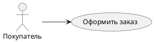
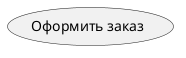
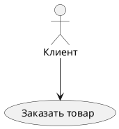
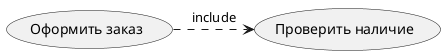
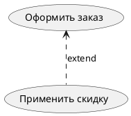
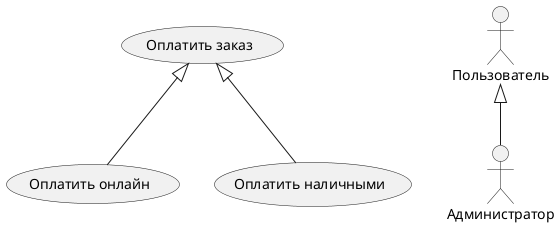
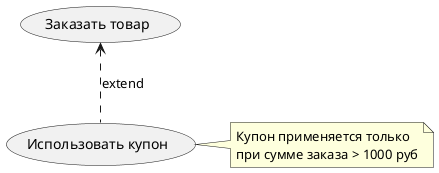
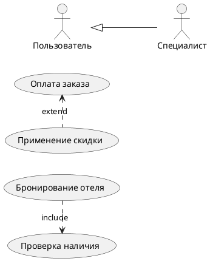
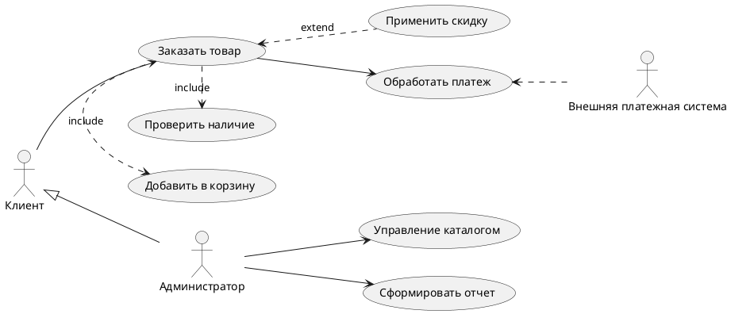

> [!summary] Основная концепция
> **Диаграмма вариантов использования (Use Case)** — высокоуровневое представление функциональных возможностей системы, показывающее:
> - Какие **функции** предоставляет система
> - Кто **взаимодействует** с системой (акторы)
> - Как функции **связаны** между собой

---

## Ключевые элементы диаграммы

### ==Актер (Actor)==

- **Роль:** Внешняя сущность, взаимодействующая с системой (пользователь, другая система)
    
- **Обозначение:** Стикмен `actor`
    
- **Особенности:**
    
    - Представляет **роль**, а не конкретного человека
        
    - Может быть обобщен через отношение `--|>`

### ==Вариант использования (Use Case)==

- **Роль:** Единица полезной функциональности системы
    
- **Обозначение:** Овал `(Название)`
    
- **Особенности:**
    
    - Название = **Глагол + Существительное** (Принять платеж, Создать отчет)
        
    - Описывает **цель**, а не последовательность действий

---

## Типы отношений

### 1. Ассоциация

- Связь между **актером** и **вариантом использования**
    
- Показывает участие актера в сценарии
    

### 2. Включение `«include»`

- **Обязательная** зависимость
    
- Вариант A **всегда** включает вариант B
    
- Пример: "Оплатить заказ" **включает** "Проверить баланс"
    

### 3. Расширение `«extend»`

- **Условная** зависимость:
    
- Вариант B **может** дополнить вариант A при определенных условиях
    
- Пример: "Оформить заказ" **может быть расширен** "Применить промокод"
    

### 4. Обобщение

- Отношение **"является частным случаем"**
    
- Применимо к актерам и вариантам использования
    

---

## Правила эффективного моделирования

1. **Комментарии**
    

2. **Уровень детализации**
    
    - 1 диаграмма = 7±2 вариантов использования
        
    - Группируйте связанные функции
        
3. **Ошибки проектирования**
    
    - ❌ Слишком много актеров на одной диаграмме
        
    - ❌ Варианты использования как последовательность шагов
        
    - ✅ Каждый UC = значимый результат для актера
        

---

## Примеры отношений

---

## Полный пример системы

> [!important] Ключевые принципы
> 
> 1. Фокус на **внешнем поведении** системы
>     
> 2. Отражение **потребностей пользователей**
>     
> 3. Описание **что**, а не как
>     
> 4. Использование для **согласования требований**
>     

---

## Ресурсы

- [Диаграммы использования в UML](http://book.uml3.ru/sec_2_2#p2)
    
- [Официальная документация PlantUML](https://plantuml.com/ru/use-case-diagram)

---
Ссылки:
[[UML]]