### Введение: от математики к практике

Исторический контекст

· 1950-е: Конечные автоматы (FSM) как математическая модель в теории вычислений
· 1980-е: Дэвид Харрел представляет Statecharts — расширение FSM для сложных систем
· 1990-е: UML стандартизирует диаграммы состояний
· 2020-е: Statecharts активно используются в веб, мобильной разработке, IoT

### 📊 Часть 1: Теоретическая основа — Конечные автомат

#### 1.1 Формальное определение FSM

Конечный автомат — это кортеж из 5 элементов:

M = (Q, Σ, δ, q₀, F)
Где:

· Q — конечное множество состояний
· Σ — конечный входной алфавит
· δ — функция переходов: Q × Σ → Q
· q₀ ∈ Q — начальное состояние
· F ⊆ Q — множество конечных (принимающих) состояний

#### 1.2 Типы автоматов

Автомат Мили (Mealy Machine)

Выход зависит от состояния И входа
δ: Q × Σ → Q
λ: Q × Σ → Γ (функция выходов)

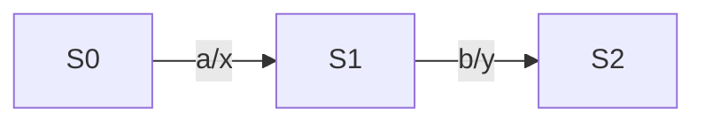

Автомат Мура (Moore Machine)

Выход зависит только от состояния
λ: Q → Γ (выход привязан к состоянию)

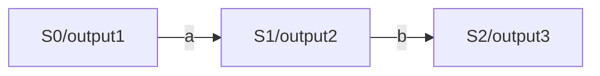

#### 1.3 Простой пример FSM: Дверь

Состояния: {Закрыта, Открыта, Блокирована}
События: {открыть, закрыть, заблокировать, разблокировать}

```python
# Псевдокод FSM для двери
class DoorFSM:
    states = {'closed', 'open', 'locked'}
    current_state = 'closed'
    
    transitions = {
        'closed': {
            'open': 'open',
            'lock': 'locked'
        },
        'open': {
            'close': 'closed'
        },
        'locked': {
            'unlock': 'closed'
        }
    }
    
    def send(self, event):
        if event in self.transitions[self.current_state]:
            self.current_state = self.transitions[self.current_state][event]
```

### 🎨 Часть 2: Практическая реализация — Диаграммы состояний UML

#### 2.1 Базовые элементы нотации

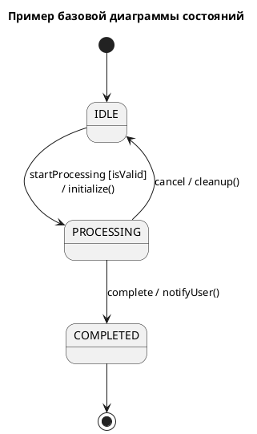

#### 2.2 Полное обозначение состояния

┌───────────────────────┐
│    НазваниеСостояния  │
├───────────────────────┤
│ entry / действиеВхода │
│ do    / активность    │
│ exit  / действиеВыхода│
└───────────────────────┘

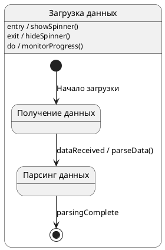

#### 2.3 Специальные состояния и псевдо состояния

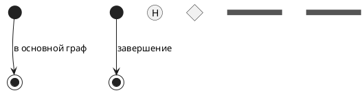

### 🔄 Часть 3: Переходы и события

#### 3.1 Полный формат перехода

┌───────────────────────────────────────────────────────┐
│   событие(параметры) [условие] / действие            │
│   ^            ^         ^          ^                 │
│   триггер      аргументы охрана     эффект           │
└───────────────────────────────────────────────────────┘

#### 3.2 Примеры переходов

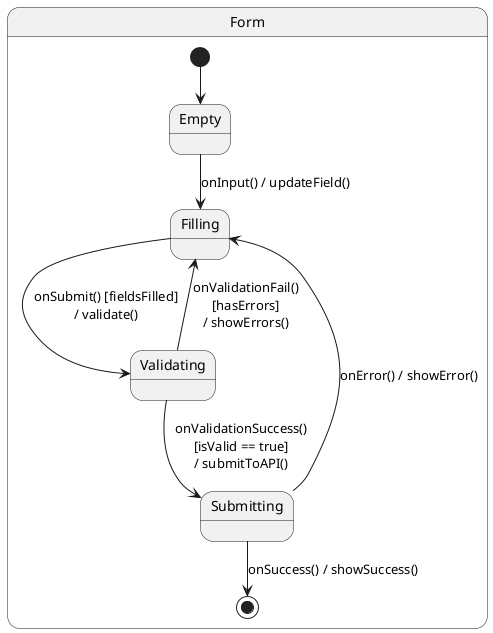

### 🏗️ Часть 4: Составные и параллельные состояния

#### 4.1 Иерархия состояний

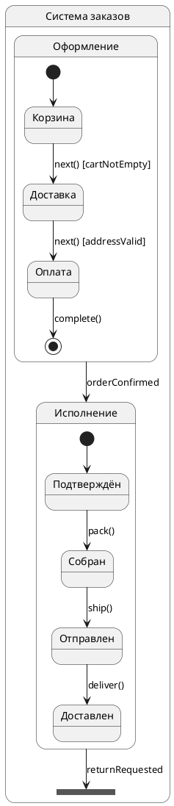

#### 4.2 Параллельные (ортогональные) состояния

```plantuml
@startuml
state "Пользовательская сессия" as session {
  state "Аутентификация" as auth {
    state "Гость" as guest
    state "Аутентифицирован" as authenticated
    state "Админ" as admin
    
    [*] --> guest
    guest --> authenticated : login() [credentialsValid]
    authenticated --> admin : elevate() [isAdmin]
  }
  
  state "Соединение" as connection {
    state "Офлайн" as offline
    state "Онлайн" as online
    state "Переподключение" as reconnecting
    
    [*] --> offline
    offline --> online : connect()
    online --> reconnecting : connectionLost()
    reconnecting --> online : reconnected()
  }
  
  -- 
  guest --> offline : начальное
  authenticated --> online : после входа
}
@enduml
```

#### 4.3 Историческое состояние

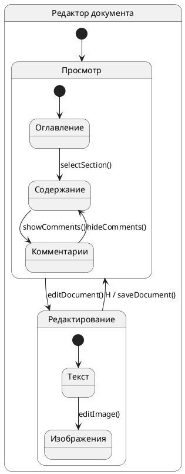

### 💻 Часть 5: Практические примеры из разработки

#### 5.1 Веб-форма с валидацией

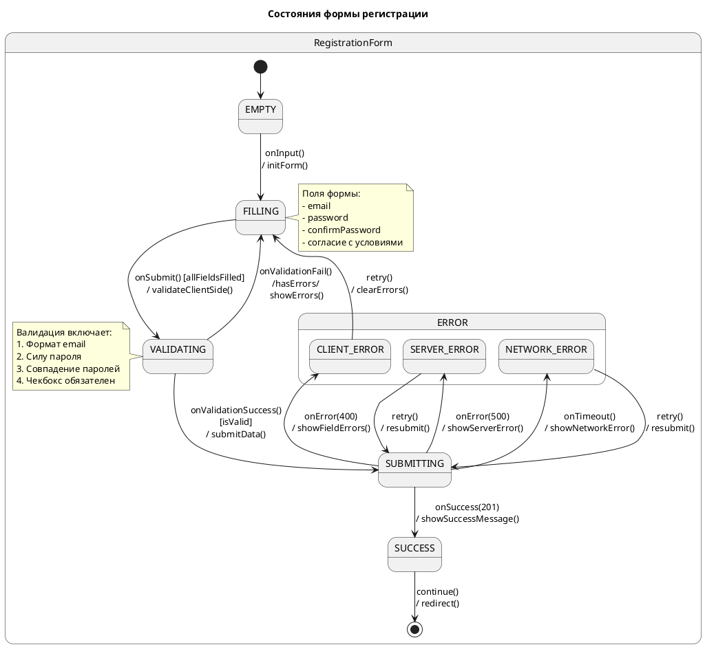

#### 5.2 API клиент с retry логикой

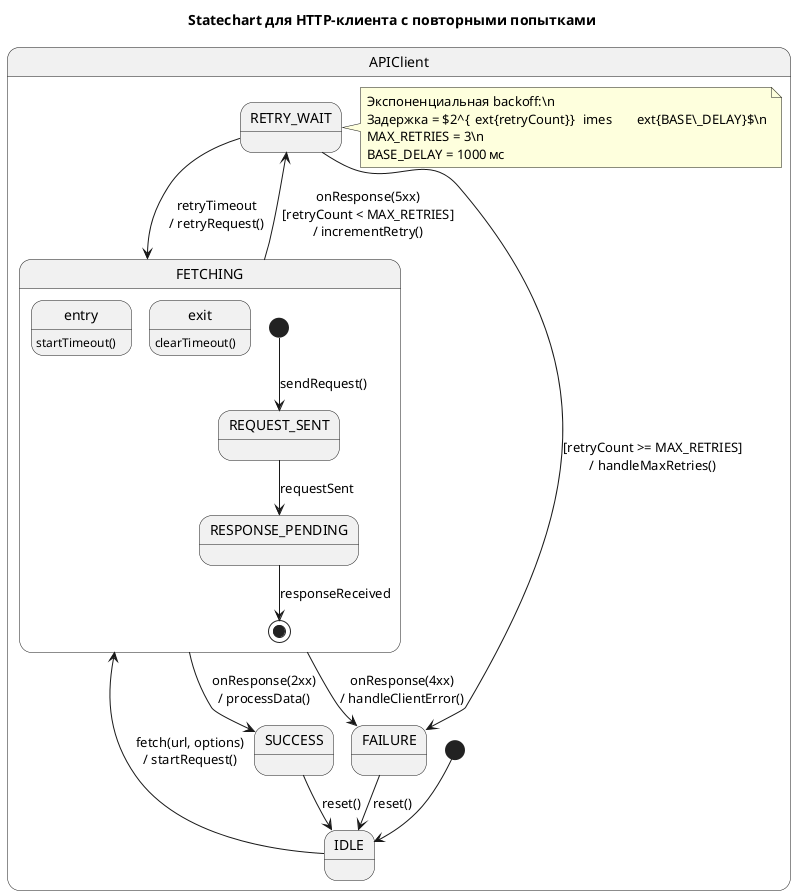

### 🛠️ Часть 6: Реализация в коде

#### 6.1 Простая реализация FSM на JavaScript

```JS
class FiniteStateMachine {
  constructor(states, initialState) {
    this.states = states;
    this.currentState = initialState;
    this.listeners = new Set();
  }
  
  transition(event, data) {
    const currentStateConfig = this.states[this.currentState];
    
    if (!currentStateConfig.transitions[event]) {
      console.warn(`No transition for event "${event}" in state "${this.currentState}"`);
      return;
    }
    
    const transition = currentStateConfig.transitions[event];
    
    // Проверка условия (guard)
    if (transition.guard && !transition.guard(data)) {
      return;
    }
    
    // Выходное действие текущего состояния
    if (currentStateConfig.onExit) {
      currentStateConfig.onExit();
    }
    
    // Действие перехода
    if (transition.action) {
      transition.action(data);
    }
    
    const previousState = this.currentState;
    this.currentState = transition.target;
    
    // Входное действие нового состояния
    const newStateConfig = this.states[this.currentState];
    if (newStateConfig.onEnter) {
      newStateConfig.onEnter();
    }
    
    // Уведомление слушателей
    this.notify(previousState, this.currentState, event, data);
  }
  
  // Пример использования
  static createDoorFSM() {
    return new FiniteStateMachine({
      closed: {
        onEnter: () => console.log('Дверь закрыта'),
        transitions: {
          open: { target: 'open', action: () => console.log('Открываю дверь') },
          lock: { target: 'locked', action: () => console.log('Блокирую дверь') }
        }
      },
      open: {
        onEnter: () => console.log('Дверь открыта'),
        transitions: {
          close: { target: 'closed', action: () => console.log('Закрываю дверь') }
        }
      },
      locked: {
        onEnter: () => console.log('Дверь заблокирована'),
        transitions: {
          unlock: { 
            target: 'closed', 
            action: () => console.log('Разблокирую дверь'),
            guard: (data) => data.hasKey // Условие: есть ключ
          }
        }
      }
    }, 'closed');
  }
}

// Использование
const door = FiniteStateMachine.createDoorFSM();
door.transition('open'); // Открывает дверь
door.transition('close'); // Закрывает дверь
door.transition('lock'); // Блокирует
door.transition('unlock', { hasKey: true }); // Разблокирует с ключом
```

#### 6.2 Современный подход с XState

```JS
import { createMachine, interpret } from 'xstate';

// Statechart для формы входа
const loginMachine = createMachine({
  id: 'login',
  initial: 'idle',
  context: {
    username: '',
    password: '',
    error: null,
    retries: 0
  },
  states: {
    idle: {
      on: {
        INPUT_CHANGE: {
          actions: 'updateField'
        },
        SUBMIT: {
          target: 'validating',
          cond: 'formFilled'
        }
      }
    },
    validating: {
      entry: 'validateForm',
      on: {
        VALIDATION_SUCCESS: 'submitting',
        VALIDATION_FAILED: {
          target: 'idle',
          actions: 'setErrors'
        }
      }
    },
    submitting: {
      entry: 'showLoading',
      invoke: {
        src: 'submitToAPI',
        onDone: {
          target: 'success',
          actions: 'onLoginSuccess'
        },
        onError: {
          target: 'error',
          actions: 'onLoginError'
        }
      },
      on: {
        CANCEL: 'idle'
      }
    },
    success: {
      type: 'final',
      entry: 'redirectToDashboard'
    },
    error: {
      on: {
        RETRY: {
          target: 'submitting',
          cond: 'canRetry',
          actions: 'incrementRetries'
        },
        RESET: 'idle'
      }
    }
  }
}, {
  actions: {
    updateField: (context, event) => {
      context[event.field] = event.value;
    }
  },
  guards: {

formFilled: (context) => 
      context.username && context.password,
    canRetry: (context) => 
      context.retries < 3
  },
  services: {
    submitToAPI: async (context) => {
      const response = await fetch('/api/login', {
        method: 'POST',
        body: JSON.stringify({
          username: context.username,
          password: context.password
        })
      });
      if (!response.ok) throw new Error('Login failed');
      return response.json();
    }
  }
});

// Запуск машины
const loginService = interpret(loginMachine)
  .onTransition((state) => {
    console.log('Текущее состояние:', state.value);
  })
  .start();

// Отправка событий
loginService.send({
  type: 'INPUT_CHANGE',
  field: 'username',
  value: 'user@example.com'
});
```

# 📈 Часть 7: Паттерны и анти паттерны

#### 7.1 Хорошие практики

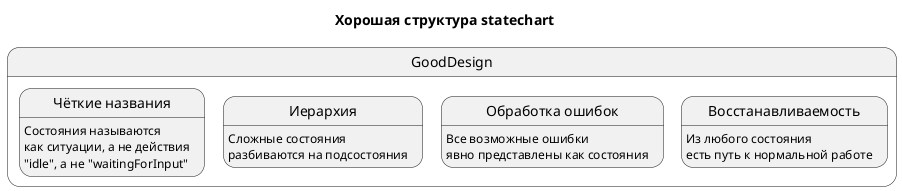

#### 7.2 Анти паттерны

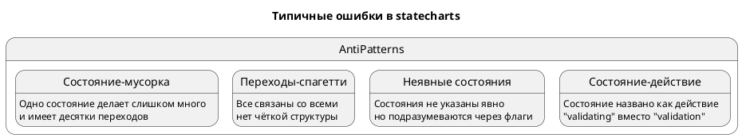

### 🎓 Часть 8: Применение в реальных проектах

#### 8.1 Где использовать state charts:

1. UI компоненты — формы, модальные окна, виджеты
2. Процессы — оформление заказа, регистрация, onboarding
3. Анимации — состояния анимаций, переходы
4. Игры — AI, физика, управление персонажем
5. IoT устройства — протоколы связи, управление питанием
6. Бизнес-процессы — workflow, approval flows

#### 8.2 Инструменты и библиотеки:

· Визуализация: PlantUML, Mermaid.js, draw.io
· Библиотеки: XState (JS), Robot (JS), Stateless (.NET), SwiftState (iOS)
· Сервисы: Stately.ai (визуальный редактор + кодогенерация)
· Стандарты: SCXML (W3C стандарт для statecharts)

### 📚 Заключение и ключевые выводы

Связь теория ↔ практика:

Теория (FSM) → Расширение (Statecharts) → Практика (UML) → Код (библиотеки)
`

Что важно запомнить:

1. FSM — математическая основа, Statecharts — практическое расширение
2. Иерархия и параллелизм — ключевые преимущества statecharts
3. Диаграммы UML — стандарт визуализации для команды
4. Современные библиотеки делают statecharts исполняемыми
5. Паттерны помогают избежать типичных ошибок

Философия:

"Сложное поведение = Простые состояния + Чёткие переходы"

Statecharts помогают управлять сложностью через:

· Декомпозицию (разбиение на подсостояния)
· Детерминизм (предсказуемое поведение)
· Визуализацию (понятно всей команде)
· Тестируемость (легко покрыть все переходы)

📖 Дополнительные ресурсы

1. Книги:
   · "Practical UML Statecharts in C/C++" by Miro Samek
   · "Programming Game AI by Example" by Mat Buckland
2. Статьи:
   · Statecharts.github.io — онлайн курс
   · CSS-Tricks: "State Machines in JavaScript"
3. Видео:
   · "The World of Statecharts" — David Khourshid
   · "Infinitely Better UIs with Finite Automata" — Kyle Shevlin