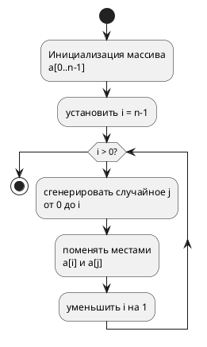

## Теоретические основы алгоритма Фишера-Йетса

### Историческая справка и основные понятия

Алгоритм Фишера-Йетса, также известный как тасование Кнута, — это алгоритм для создания случайных перестановок конечного множества, обеспечивающий **равномерное распределение** вероятностей для всех возможных перестановок. 

Первоначальный метод был разработан Рональдом Фишером и Франком Йетсом в 1938 году, а современную эффективную версию опубликовал Ричард Дурстенфельд в 1964 году. Алгоритм работает за время O(n) и выполняется in-place.

### Связь с музыкальным миксером

В контексте музыкального миксера алгоритм Фишера-Йетса обеспечивает **честное перемешивание плейлиста**, где каждая композиция имеет равную вероятность оказаться на любой позиции. В отличие от наивных методов, этот алгоритм исключает предсказуемость и кластеризацию песен одного исполнителя, создавая действительно случайную последовательность.

## Математическое обоснование

### Формальное описание алгоритма

Для массива из n элементов (индексы от 0 до n-1) алгоритм выполняется следующим образом:

```
for i от n-1 вниз до 1:
    j = случайное целое число из [0, i]
    поменять местами a[i] и a[j]
```

### Уравнения вероятности

Вероятность получения любой конкретной перестановки равна:

$$
P(a) = \frac{1}{n!} \quad \text{для любой перестановки } a
$$

Это следует из того, что на каждом шаге i мы выбираем элемент из i+1 оставшихся:

$$
P(\text{конкретная перестановка}) = \prod_{i=n-1}^{1} \frac{1}{i+1} = \frac{1}{n \times (n-1) \times \cdots \times 2 \times 1} = \frac{1}{n!}
$$

Вероятность того, что элемент окажется на позиции k:

$$
P(\text{элемент x на позиции k}) = \frac{1}{n}
$$

## Блок-схема алгоритма



## Реализация на Python

```python
import random

def fisher_yates_shuffle(playlist):
    """
    Реализация алгоритма Фишера-Йетса 
    для перемешивания музыкального плейлиста
    """
    playlist = playlist.copy()  # Создаем копию для неизменности оригинала
    n = len(playlist)
    
    for i in range(n-1, 0, -1):
        # Выбираем случайный индекс от 0 до i включительно
        j = random.randint(0, i)
        
        # Меняем местами текущий элемент со случайно выбранным
        playlist[i], playlist[j] = playlist[j], playlist[i]
    
    return playlist

# Пример использования с музыкальным плейлистом
if __name__ == "__main__":
    my_playlist = [
        "Queen - Bohemian Rhapsody",
        "The Beatles - Hey Jude", 
        "Led Zeppelin - Stairway to Heaven",
        "Pink Floyd - Comfortably Numb",
        "The Rolling Stones - Satisfaction",
        "David Bowie - Space Oddity"
    ]
    
    print("Исходный плейлист:")
    for i, song in enumerate(my_playlist):
        print(f"{i+1}. {song}")
    
    shuffled_playlist = fisher_yates_shuffle(my_playlist)
    
    print("\nПеремешанный плейлист:")
    for i, song in enumerate(shuffled_playlist):
        print(f"{i+1}. {song}")
```

### Ключевые особенности реализации:
- **Временная сложность**: O(n)
- **Пространственная сложность**: O(1) при работе in-place или O(n) при создании копии
- **Равномерность распределения**: Гарантирует, что каждая перестановка равновероятна

## Практическое применение в музыкальных миксерах

### Преимущества перед другими методами

В музыкальных приложениях алгоритм Фишера-Йетса обеспечивает:
- **Исключение предсказуемости** - пользователь не может угадать следующую композицию
- **Отсутствие кластеризации** - песни одного исполнителя равномерно распределяются
- **Честное перемешивание** - все композиции имеют равные шансы

### Особенности реализации в реальных системах

На практике музыкальные плееры часто используют модифицированные версии алгоритма, учитывающие:
- Предыдущие сессии воспроизведения
- Пользовательские предпочтения
- Музыкальные характеристики (темп, тональность)

Однако основа таких систем остается той же — обеспечение математически корректного случайного перемешивания.

Этот материал дает полное представление об алгоритме Фишера-Йетса и его применении в музыкальных миксерах, включая математическое обоснование, визуальное представление и практическую реализацию.